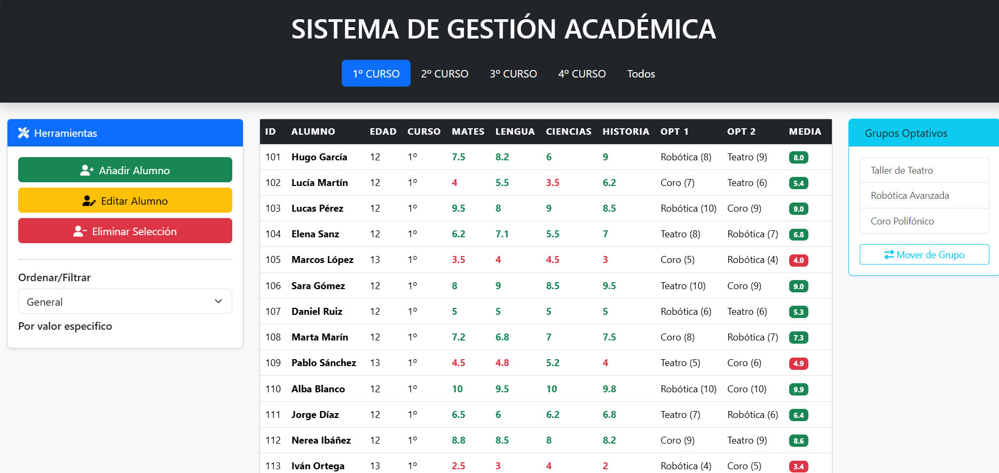
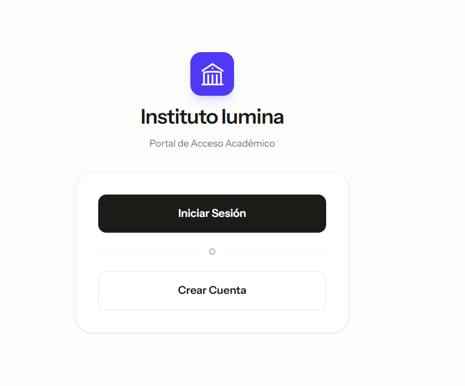
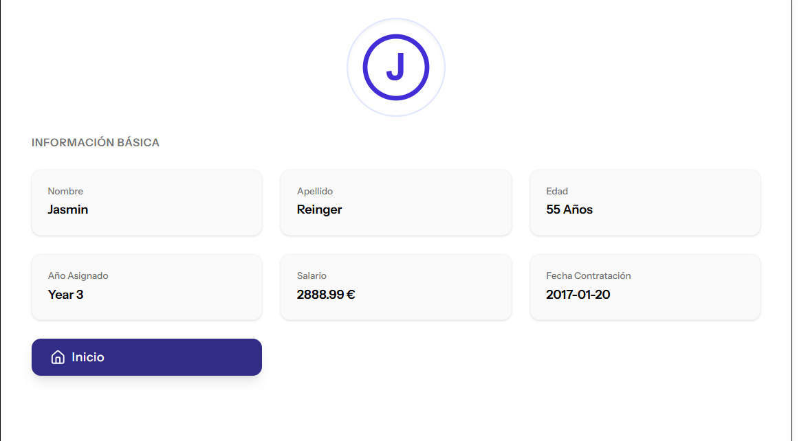
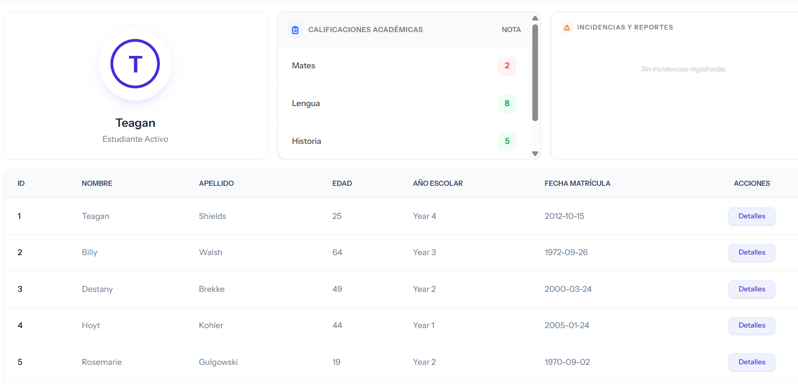
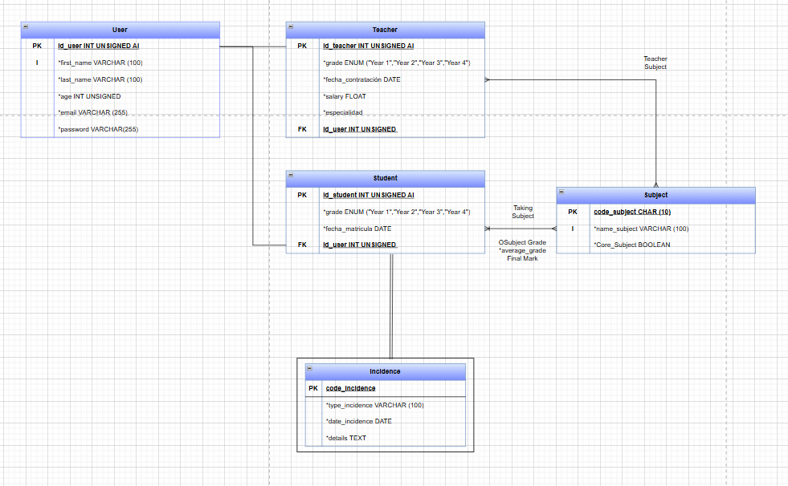
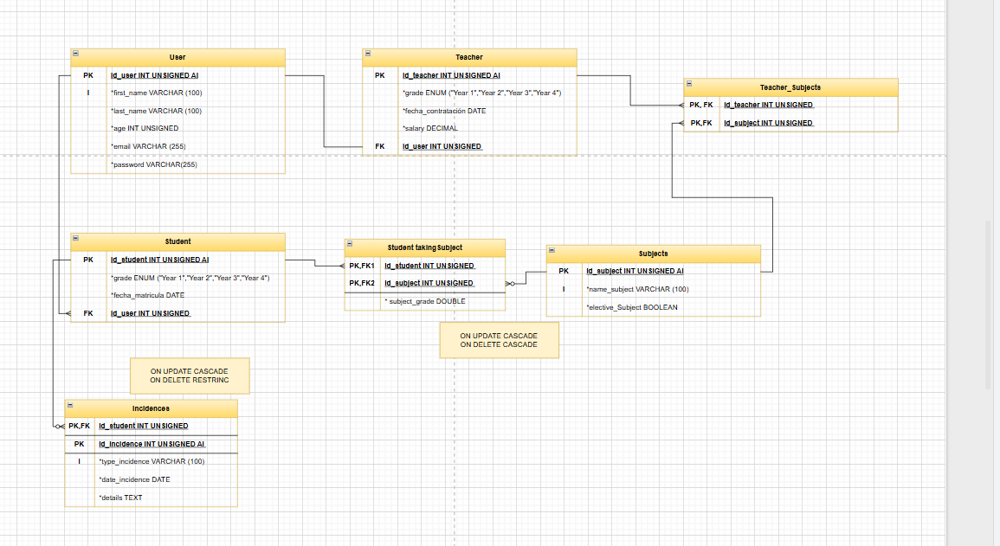

# gestoriaV2

> Proyecto archivado. Fue el laboratorio de exploración previo a 
> [MizumeBlog](https://mizumeblog.es/), donde apliqué en producción todo lo aprendido aquí.

## Origen y contexto
Este proyecto tiene sus raíces en mi repositorio [Openwebinars](https://github.com/Mizume25/Openwebinars), donde
comencé a aplicar gestión de arrays y construcción de objetos con métodos como
filter, find, map y sort, y donde empecé a modularizar el código aplicando los
principios DRY (Don't Repeat Yourself) y SRP (Single Responsibility Principle),
separando responsabilidades en archivos JavaScript con tareas específicas (service, api,ui/ux, main etc...).

Con esa base, desarrollé una primera versión de la gestoría en local con JSX,
que quedó incompleta al decidir rehacer el proyecto desde cero con TypeScript
y una arquitectura más sólida. De esa decisión nació gestoriaV2.

## Qué exploré en este proyecto

**Autenticación y sesiones con Laravel Breeze**

Fue mi primer contacto real con la gestión de sesiones. Mediante Laravel Breeze
configuré autenticación con middleware, y utilicé factories y seeders para
generar usuarios de prueba con datos ficticios.

**Interfaz con React y TailwindCSS**

Practiqué por primera vez el stack React + Laravel, aplicando hooks, 
desestructuración de objetos y conceptos avanzados de TypeScript. TailwindCSS
fue mi primera experiencia con un framework de utilidades CSS, tras haber
construido el responsive de BlogPersonal con CSS puro.

**Diseño de base de datos**

Fue también mi primer proyecto donde apliqué diseño de entidades de base de
datos de forma estructurada, trabajando con el modelo entidad-relación antes
de escribir una sola migración.

## Conclusiones
gestoriaV2 cumplió su función como laboratorio: me permitió entender la
integración entre Laravel y React en un entorno controlado, sin la presión
de construir algo definitivo. Los límites que encontré aquí, especialmente
en arquitectura y organización del código, fueron los que definieron las
decisiones de diseño de MizumeBlog.